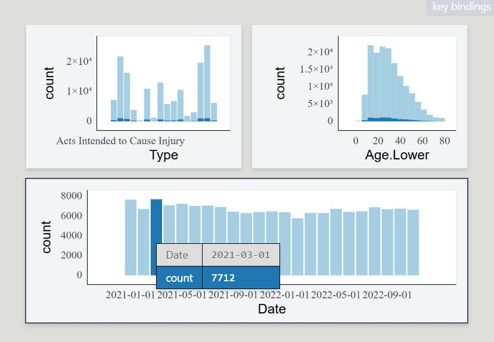

See the [assignment description](https://www.stat.auckland.ac.nz/~paul/stats787/Current/Labs/interaction.html) and [model answer](https://www.stat.auckland.ac.nz/~paul/stats787/Current/Labs/interaction-model.html) (for the source .Rmd model answer, just change "html" to "Rmd" in the link).

```{r setup, include=FALSE}
knitr::opts_chunk$set(
  dev.args = list(png = list(type = "cairo"))
)
```

Loading packages.
```{r message = FALSE, warning = FALSE}
library(tidyverse)
library(grid)
library(plotly)
library(plotscaper)
```

# The data and questions of interest

Data shows rows of incidents handled by the Police.

```{r}
crime <- read.csv("nzpolice-proceedings.csv")
crime$Month <- as.Date(crime$Date)
crime$Year <- as.POSIXlt(crime$Date)$year + 1900
typeCount <- table(crime$ANZSOC.Division)
crime$Type <- factor(crime$ANZSOC.Division,
                     levels=names(typeCount)[order(typeCount)])
crime <- subset(crime, Year >= 2015)
```

Create data with counts.

```{r}
counts <- as.data.frame(table(crime$Type, crime$Month))
names(counts) <- c("Type", "Month", "Freq")
counts$Month <- as.Date(counts$Month)
counts$Abbrev <- counts$Type
levels(counts$Abbrev) <- sub("(.+?)(,|and|With|Offences|Endangering)(.+)",
                             "\\1", levels(counts$Abbrev))
```

## Questions of interest

- How do the trends over time differ between types of crime?
- Are all crime types decreasing in frequency?
- Are there any unusual patterns for any crime types?

# Data visualisations and questions

## Question 1

We create the interactive plot by using the `plotly::ggplotly` function on our created plot, where we take advantage of the unofficial aesthetic `text` supported by plotly to create tooltips to ensure we get the entire crime type label on the tooltip.

```{r, fig.width=8, fig.height=6, warning = FALSE}
plotly::ggplotly(
  ggplot(counts, aes(x = Month, y = Freq, group = Abbrev, color = Abbrev)) + 
    geom_line(aes(text = Type)),
  tooltip = c("x", "y", "text")
)
```

We can zoom in the interactive plot and save to png directly in the interface to investigate and capture things in data.


We can choose interactively what groups to include in the plot by simply clicking them in the legend.


### Aswering questions

Using tooltip, we see that the sudden dip for Dangerous or Negligent Acts occured in April of 2020 as shown on the below screenshot.


- In the same month that *Dangerous or Negligent Acts* takes a big dip, *Offences Against Justice Procedures, Govt Sec and Govt Ops* and *Miscellaneous Offences* has very big spikes. Some of the spike for *Miscellaneous Offences* is visible on one of the above screenshots.
- The trends in *Public Order Offences* and *Dangerous or Negligent Acts* are complete opposite as the latter is on an upward trend throughout the period, whereas the former is on a steep downward trend. Can be seen from earlier screenshot.
- Fx. *Theft and Related Offences* is on a downward trend except for increasing from year 2022 onward, as is true for other categories as well. However, for *Offences Against Justice Procedures, Govt Sec and Govt Ops* this is not true. Except for a big spike, the frequency of crimes for this crime type is close to constant, but does see a bit of a decrease from about 2022. See figure 4.
- *Sexual Assault and Related Offences* and *Prohibited and Regulated Weapons and Explosives Offences* have very similar trends across time with white noise around a quite static mean. However, both around year 2020 and 2022 *Sexual...* dips a bit while *Prohibited...* increases. See figure 5.


## Question 2

Limit the data to be only from 2021 onwards

```{r}
crimeRecent <- subset(crime, Year >= 2021)
```

Create the linked interactive plots with `plotscaper` with the correct layout by creating a schema with `create_schema` and using the `set_layout` function to control the placement of the figures.

```{r}
schema <- crimeRecent %>%
  create_schema() %>% 
  add_barplot("Type") %>% 
  add_histogram("Age.Lower") %>% 
  add_barplot("Date")

layout <- matrix(c(
  1, 2,
  3, 3
), ncol = 2, byrow = TRUE)

schema %>% 
  set_layout(layout) %>% 
  render()
```

### Using tooltips

We use the "query mode" with the keybind "q" and then hover over the bars to get tooltips. We see that the month with the highest crime count is March of 2021 with a crime count of 7712.



### Investigating youth offending

We can drag the mouse to choose the groups with `Age.Lower` at 15 or less.


It is a bit hard to inspect the crime count for youth offenders just from a visual inspection, but we can use the query mode to inspect the numbers.

```{r, echo=FALSE,out.width="70%", out.height="10%",fig.cap="Crime count for youth offenders at 3 different time points",fig.show='hold',fig.align='center'}
knitr::include_graphics(c("images/q2_2022_3.JPG","images/q2_2022_1.JPG", "images/q2_2022_2.JPG"))
```

We see quite a big increase in youth offending from January 2022 to August 2022 from the figure. An increase during the first half of 2022 does happen, but the highest count at all for youth offending is the count shown for August 2022. The second-highest count is shown from March 2021, where it's seen that the total count is also quite a bit higher, meaning that youth offending is quite a bit more prevalent relative to other age groups in the second half of 2022.

### Distribution of crime types

We see that the distribution of crime types are quite different for `Age.Lower = 15` and `Age.Lower = 20`. We need to use the tooltips to identify the crime types. Below we look at the two crime types that are some of the most frequent and with differences between the age groups. 

`Age.Lower = 15` is in the top row, and `Age.Lower = 20` in the bottom.

```{r, echo=FALSE,out.width="45%", out.height="10%",fig.cap="Figure 8: Crime count for youth offenders at 3 different time points",fig.show='hold',fig.align='center'}
knitr::include_graphics(c("images/q2_crimedist_age15_theft.JPG",
                          "images/q2_crimedist_age15_traffic.JPG",
                          "images/q2_crimedist_age20_theft.JPG",
                          "images/q2_crimedist_age20_traffic.JPG"))
```

We see the largest difference for *Theft and related offences*, where the count is 1916 for age group 20 and 3448 for age group 15, being the highest of all age groups. The opposite is true for *Traffic and Vehicle Regulatory Offences*, where age group 20 has the highest count of any age group with 3884 versus 3263 for age group 15.

# Overall summary

We can use the `ggplotly` function in the `plotly` package to create an interactive plot directly from a ggplot. The interactivity that `ggplotly` provides is

- Customisable tooltips (use `text` aesthetic in the ggplot to alter the tooltip)
  - "Comparison tooltips" available
- Interactive discrete legends
- Zooming, panning, etc.
- Save screenshot to png

Another tool is the `plotscaper` package which has the power of creating *linked* interactive plots. Customisability is quite low, but it provides quite powerful tools with a simple interface.

Lastly we have `shiny` (in a seperate "lab7_shiny.Rmd" file), which can be used to create apps. In this case, we can enable the user to select inputs in different ways and then alter our plot accordingly.